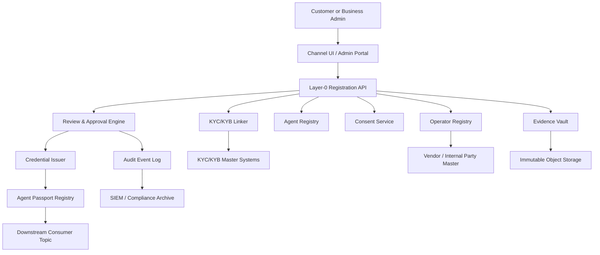
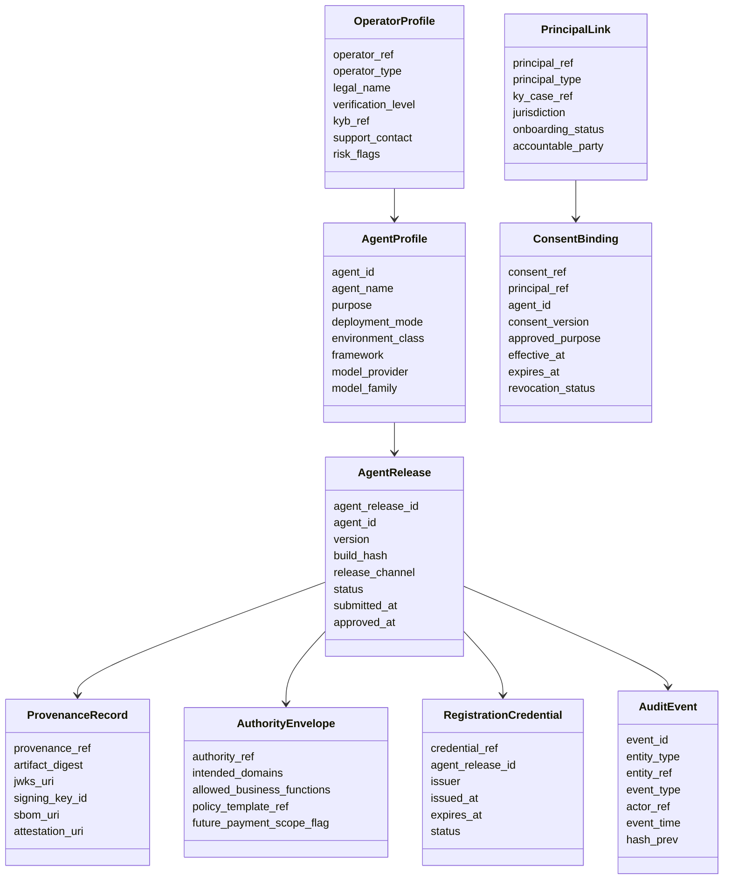
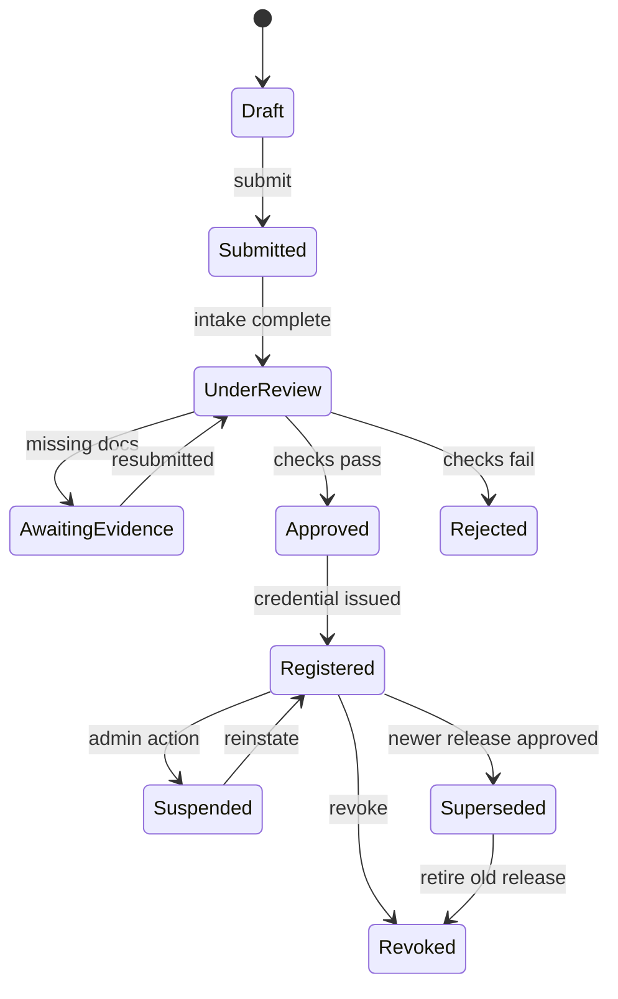
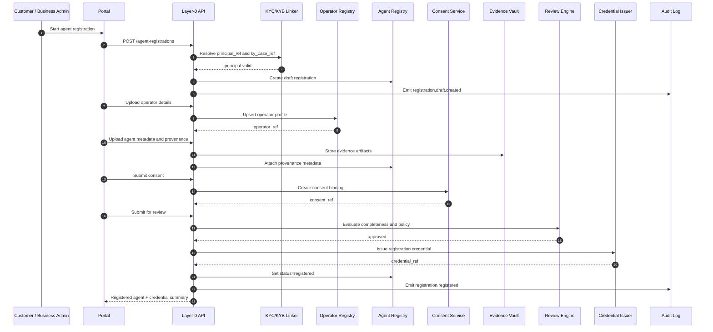
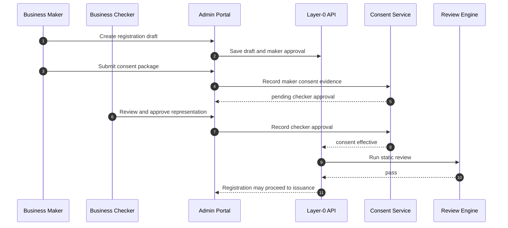
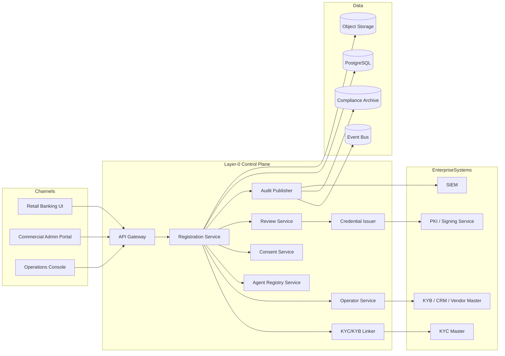

# Layer-0 Pre-Registration for KYA Tied to KYC/KYB

Version: 1.0  
Date: June 2026  
Audience: Enterprise architecture, identity, onboarding, compliance, platform engineering

## 1. Objective

This document defines a detailed technical design for a **layer-0 pre-registration** capability for AI agents in a financial institution. The scope is intentionally limited to **pre-registration and linkage to KYC/KYB**. Request-time validation, behavioral scoring, runtime risk controls, and payment authorization are out of scope for this version.

The purpose of layer-0 is to create a bank-controlled trust record that answers the following before an agent is ever allowed into downstream payment or banking flows:

1. Which verified principal does the agent represent?
2. Which verified operator or developer built or manages the agent?
3. Which exact agent artifact or version is being registered?
4. What static authority envelope and business purpose has been approved for later use?
5. What registration credential and audit evidence prove the agent is known to the institution?

## 2. Scope boundaries

### In scope

- Link agent registration to an existing KYC or KYB approved principal.
- Register the operator or developer behind the agent.
- Capture agent provenance and static metadata.
- Capture customer or business consent for representation.
- Perform static review and approval.
- Issue a layer-0 registration credential or agent passport.
- Persist lifecycle state and audit evidence.

### Out of scope

- Request-time transaction validation.
- Runtime behavioral analytics.
- Dynamic step-up authentication.
- Real-time fraud or AML scoring.
- Payment rail execution.
- Merchant-side acceptance logic.
- On-device runtime attestation enforcement.

## 3. Design principles

- The agent is **not** an independent customer. It is a governed software actor linked to an existing person or business.
- KYC/KYB remains the source of truth for customer identity; layer-0 stores references, not duplicated onboarding files.
- Registration is version-aware; trust attaches to an agent identity and approved version set.
- The operator, principal, and agent are modeled separately.
- Approval is evidence-based and deterministic.
- Issued registration artifacts must be revocable and auditable.
- Downstream systems should consume registration state asynchronously and remain decoupled from onboarding workflows.

## 4. High-level architecture



## 5. Component architecture

### 5.1 Channel UI / Admin Portal

Used by retail customers, commercial administrators, operations teams, and compliance reviewers to create or approve registrations. This can be embedded in digital banking, treasury portals, or a separate agent-management console.

### 5.2 Layer-0 Registration API

The orchestration façade for the workflow. It validates payload shape, drives lifecycle transitions, and hides internal service composition from channels.

### 5.3 KYC/KYB Linker

Resolves the principal against the customer master domain.

Responsibilities:
- Verify the referenced person or business exists.
- Confirm KYC or KYB status is active and not restricted.
- Pull minimal non-sensitive attributes needed for registration, such as customer type, jurisdiction, segment, and owning relationship manager or accountable admin.
- Return a canonical `principal_ref` and `ky_case_ref`.

### 5.4 Operator Registry

Maintains the verified profile of the entity that built, distributes, or operates the agent.

Responsibilities:
- Model first-party, customer-built, and third-party operators.
- Link to existing business master or vendor master where available.
- Store support contacts, contractual identifiers, and policy flags.
- Record whether operator verification is self-attested, enterprise-approved, or KYB-backed.

### 5.5 Agent Registry

System of record for agent identity and versioned registration state.

Responsibilities:
- Maintain stable `agent_id` and versioned `agent_release_id`.
- Store static metadata, purpose, framework, model family, deployment mode, environment class, and ownership links.
- Track lifecycle state for each release.
- Maintain links to provenance records, consent bindings, approvals, and issued credentials.

### 5.6 Consent Service

Captures proof that the principal has allowed the agent to represent them for a business purpose.

Responsibilities:
- Store consent text version and acceptance evidence.
- Bind approved use cases to the agent registration.
- Support expiry and revocation metadata.
- Handle retail single-user consent and commercial dual-control or maker-checker approval patterns.

### 5.7 Evidence Vault

Stores files and structured evidence used during registration.

Artifacts include:
- JWKS or public signing material.
- Build hash or artifact digest.
- SBOM reference.
- Policy declarations.
- Terms and consent records.
- Internal review notes and approval evidence.

### 5.8 Review & Approval Engine

Performs deterministic static checks and controls workflow state.

Checks include:
- Principal status valid.
- Required evidence present.
- Operator not on deny list.
- Agent metadata complete.
- Consent present and unexpired.
- Mandatory approvers recorded.

### 5.9 Credential Issuer

Issues a signed layer-0 registration credential after approval.

The credential is not a payment authorization token. It is a preregistration artifact proving the bank knows the agent, its operator, its linked principal, and the approved static scope.

### 5.10 Audit Event Log

Publishes immutable lifecycle events for creation, updates, review, approval, suspension, revocation, and supersession.

## 6. Logical data model



## 7. Canonical lifecycle



## 8. End-to-end registration sequence



## 9. Commercial dual-control sequence



## 10. Deployment view



## 11. Detailed workflow states

### 11.1 Draft
Created after principal linkage succeeds. The record is incomplete and not visible to downstream systems.

### 11.2 Submitted
All mandatory registration fields are present and the user or business admin has declared the package ready for review.

### 11.3 Under review
Static checks run, reviewers validate evidence, and policy exceptions are evaluated.

### 11.4 Approved
The registration package has passed review but the credential may not yet be issued.

### 11.5 Registered
The credential is issued, registry status is active, and the agent becomes visible to downstream consumer systems as a known preregistered actor.

### 11.6 Suspended / Revoked / Superseded
Administrative states used for lifecycle control without touching the underlying KYC/KYB status of the represented principal.

## 12. API design

### 12.1 Create draft registration

```http
POST /v1/principals/{principal_ref}/agent-registrations
Content-Type: application/json
```

```json
{
  "principalType": "business",
  "registrationMode": "customer_hosted",
  "agentName": "Treasury Procurement Agent",
  "purpose": "supplier sourcing and invoice preparation",
  "deploymentEnvironment": "customer_vpc",
  "operatorType": "third_party"
}
```

Response:

```json
{
  "registrationId": "reg_01JZ...",
  "status": "draft",
  "principalRef": "biz_12345",
  "kyCaseRef": "kyb_99881"
}
```

### 12.2 Attach operator profile

```http
POST /v1/agent-registrations/{registrationId}/operator
```

```json
{
  "operatorType": "third_party",
  "legalName": "Example Agent Systems Pvt Ltd",
  "operatorRefExternal": "vendor_456",
  "kybRef": "kyb_vendor_456",
  "supportContacts": [
    {"name": "Ops Desk", "email": "ops@example.com"}
  ]
}
```

### 12.3 Attach agent provenance

```http
POST /v1/agent-registrations/{registrationId}/provenance
```

```json
{
  "framework": "custom-python",
  "modelProvider": "internal-or-vendor",
  "modelFamily": "multi-agent-orchestrator",
  "version": "1.3.7",
  "buildHash": "sha256:8c2f...",
  "releaseChannel": "stable",
  "jwksUri": "https://agent.example.com/.well-known/jwks.json",
  "artifactDigest": "sha256:91ab...",
  "sbomUri": "s3://evidence/reg_01JZ/sbom.json"
}
```

### 12.4 Attach consent binding

```http
POST /v1/agent-registrations/{registrationId}/consent
```

```json
{
  "consentVersion": "2026-06-01",
  "approvedPurpose": "bank connectivity and future payment initiation",
  "acceptedBy": "admin.user@example.com",
  "effectiveAt": "2026-06-24T09:00:00Z",
  "expiresAt": "2027-06-24T09:00:00Z",
  "evidenceUri": "s3://evidence/reg_01JZ/consent.pdf"
}
```

### 12.5 Submit for review

```http
POST /v1/agent-registrations/{registrationId}/submit
```

### 12.6 Approve and register

```http
POST /v1/agent-registrations/{registrationId}/approve
```

```json
{
  "decision": "approve",
  "approver": "ops.reviewer@bank.com",
  "comment": "Static registration checks passed"
}
```

### 12.7 Suspend / revoke

```http
POST /v1/registered-agents/{agentId}/suspend
POST /v1/registered-agents/{agentId}/revoke
```

## 13. Registration credential format

A practical v1 credential can be a signed JWT or JWS-protected JSON envelope.

Example claims:

```json
{
  "iss": "bank.example.layer0",
  "sub": "agent:agt_01JZ...",
  "agent_id": "agt_01JZ...",
  "agent_release_id": "rel_01JZ...",
  "principal_ref": "biz_12345",
  "principal_type": "business",
  "operator_ref": "op_456",
  "ky_case_ref": "kyb_99881",
  "consent_ref": "cons_01JZ...",
  "provenance_ref": "prov_01JZ...",
  "registration_level": "layer0",
  "registration_status": "registered",
  "iat": 1782280000,
  "exp": 1813816000
}
```

This artifact proves preregistration only. Downstream systems must not infer payment approval from this credential.

## 14. Relational schema sketch

```sql
create table principal_link (
  principal_ref varchar(64) primary key,
  principal_type varchar(16) not null,
  ky_case_ref varchar(64) not null,
  jurisdiction varchar(32),
  onboarding_status varchar(32) not null,
  accountable_party varchar(128),
  created_at timestamptz not null default now()
);

create table operator_profile (
  operator_ref varchar(64) primary key,
  operator_type varchar(32) not null,
  legal_name varchar(256) not null,
  verification_level varchar(32) not null,
  kyb_ref varchar(64),
  support_contacts jsonb,
  risk_flags jsonb,
  created_at timestamptz not null default now()
);

create table agent_profile (
  agent_id varchar(64) primary key,
  operator_ref varchar(64) not null references operator_profile(operator_ref),
  agent_name varchar(256) not null,
  purpose text not null,
  deployment_mode varchar(32) not null,
  environment_class varchar(64),
  framework varchar(128),
  model_provider varchar(128),
  model_family varchar(128),
  created_at timestamptz not null default now()
);

create table agent_release (
  agent_release_id varchar(64) primary key,
  agent_id varchar(64) not null references agent_profile(agent_id),
  principal_ref varchar(64) not null references principal_link(principal_ref),
  version varchar(64) not null,
  build_hash varchar(256) not null,
  release_channel varchar(32),
  status varchar(32) not null,
  submitted_at timestamptz,
  approved_at timestamptz,
  registered_at timestamptz,
  unique(agent_id, version, principal_ref)
);

create table provenance_record (
  provenance_ref varchar(64) primary key,
  agent_release_id varchar(64) not null references agent_release(agent_release_id),
  jwks_uri text,
  signing_key_id varchar(128),
  artifact_digest varchar(256),
  sbom_uri text,
  attestation_uri text,
  created_at timestamptz not null default now()
);

create table consent_binding (
  consent_ref varchar(64) primary key,
  agent_release_id varchar(64) not null references agent_release(agent_release_id),
  principal_ref varchar(64) not null references principal_link(principal_ref),
  consent_version varchar(64) not null,
  approved_purpose text not null,
  effective_at timestamptz not null,
  expires_at timestamptz,
  revocation_status varchar(32) not null default 'active',
  evidence_uri text,
  created_at timestamptz not null default now()
);

create table registration_credential (
  credential_ref varchar(64) primary key,
  agent_release_id varchar(64) not null references agent_release(agent_release_id),
  issuer varchar(128) not null,
  status varchar(32) not null,
  issued_at timestamptz not null,
  expires_at timestamptz not null,
  jti varchar(128) not null unique
);

create table audit_event (
  event_id varchar(64) primary key,
  entity_type varchar(64) not null,
  entity_ref varchar(64) not null,
  event_type varchar(64) not null,
  actor_ref varchar(128) not null,
  event_payload jsonb,
  hash_prev varchar(128),
  created_at timestamptz not null default now()
);
```

## 15. Policy rules for static approval

Examples of deterministic approval rules:

- Reject if linked KYC/KYB status is not active.
- Reject if consent is missing or expired.
- Reject if operator type is third-party and there is no verified operator record.
- Reject if version, build hash, or signing material is missing.
- Reject if the same agent version is already revoked for the same principal.
- Require checker approval for commercial principals above policy thresholds.
- Require manual compliance approval when operator verification is self-attested only.

These are layer-0 rules only. They do not score transactions or runtime behavior.

## 16. Security design

### 16.1 Identity boundaries

- Human and business identity remain in the KYC/KYB master domain.
- Agent identity remains in the agent registry domain.
- Operator identity remains in the vendor or operator registry domain.
- Registration credentials are issuer-controlled and revocable.

### 16.2 Data minimization

- Store `ky_case_ref` and `principal_ref`, not full KYC files.
- Store derived onboarding status, not unnecessary PII.
- Keep evidence in controlled object storage with immutable retention where required.

### 16.3 Integrity

- Sign issued registration credentials.
- Hash evidence files on upload.
- Include previous-event hash in audit events for tamper evidence.

### 16.4 Administrative controls

- Maker-checker for commercial onboarding.
- Fine-grained reviewer roles for registration approval.
- Separate revocation rights from registration creation rights.

## 17. Integration patterns with KYC/KYB

### 17.1 Retail linkage

For a retail customer, the portal should resolve the existing KYC identity after authentication and create a `principal_ref` bound to that person. The customer can then preregister one or more agents under their identity, each with distinct versions and consent records.

### 17.2 Commercial linkage

For a business, the registration is bound to the KYB-approved legal entity. The acting admin is not the represented principal; they are an authorized human acting for the business. Consent therefore needs both business linkage and admin approval evidence.

### 17.3 Internal bank-managed agents acting for customers

If the bank hosts or distributes the agent, the operator can be first-party while the represented principal remains external. The separation between operator and principal still holds.

## 18. Event model

Suggested emitted events:

- `registration.draft.created`
- `registration.operator.attached`
- `registration.provenance.attached`
- `registration.consent.attached`
- `registration.submitted`
- `registration.approved`
- `registration.registered`
- `registration.suspended`
- `registration.revoked`
- `registration.superseded`

Downstream consumers such as payment orchestration or API gateways should subscribe to these events to build local caches of preregistered agents.

## 19. Operational model

### 19.1 SLAs

- Draft creation: synchronous, sub-second to low seconds.
- Evidence upload: asynchronous but tracked.
- Review: human-in-the-loop and policy dependent.
- Credential issuance: synchronous after approval.

### 19.2 Version handling

- New code version means new `agent_release_id`.
- Multiple active releases may be allowed by policy.
- Supersession must not silently mutate historical evidence.

### 19.3 Revocation behavior

Revoking the registration affects the agent release, not the principal’s KYC/KYB status. This is critical for maintaining clean separation between customer identity and software trust lifecycle.

## 20. Suggested implementation stack

- API and orchestration: Python FastAPI or Java Spring Boot.
- Primary store: PostgreSQL.
- Object evidence store: S3 or GCS with immutable retention controls.
- Eventing: Kafka or Pub/Sub.
- Credential signing: enterprise PKI or dedicated signing service.
- Auth for portal and ops users: existing enterprise IdP.
- Audit export: SIEM plus long-term compliance archive.

## 21. Rollout plan

### Phase 1

- Build registry, linkage, consent, evidence, and approval workflow.
- Issue preregistration credentials.
- Publish registration events.
- No payment execution dependency yet.

### Phase 2

- Integrate downstream gateways to consume registered agent state.
- Add version revocation propagation.
- Add richer operator verification and vendor governance hooks.

### Phase 3

- Introduce runtime validation, risk scoring, and transaction-time policy checks outside the scope of this design.

## 22. Key design decisions

1. Layer-0 is a bank-owned trust registry, not just a UI workflow.
2. KYC/KYB remains authoritative; layer-0 references it.
3. Principal, operator, and agent are separate first-class entities.
4. Registration is versioned.
5. Consent is explicit and durable.
6. Issued credentials prove preregistration only.
7. Runtime validation remains a separate later layer.

## 23. Open decisions for your implementation

- Whether operator verification requires full KYB for every third-party agent vendor or only for high-risk categories.
- Whether a single stable `agent_id` spans multiple principals or whether each principal gets a scoped derived agent identity.
- Whether evidence review remains centralized or is partially delegated to line-of-business approvers.
- Whether registration credentials are JWTs, detached JWS documents, or X.509-backed certificates.
- Whether future interoperability requires optional DID support as an extension field rather than a mandatory identifier.

## 24. Final view

The correct mental model is: **KYC/KYB proves who the principal is; layer-0 proves which software actor is allowed to represent that principal in principle**. That separation gives you the right governance boundary for later payment delegation without forcing runtime validation concerns into the onboarding plane.
